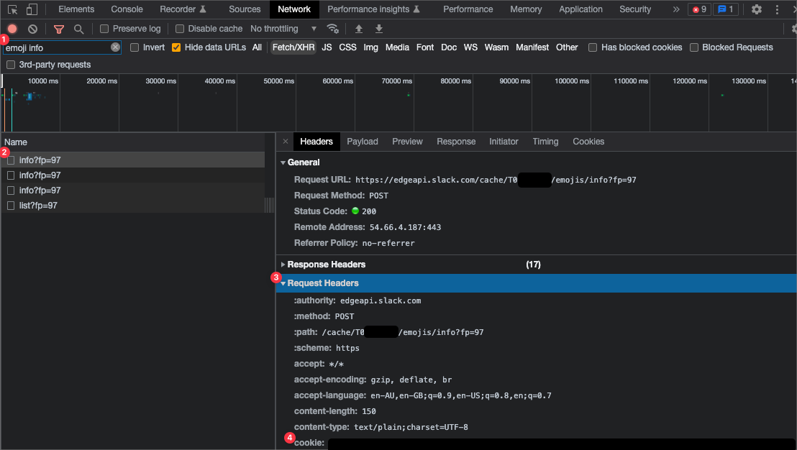
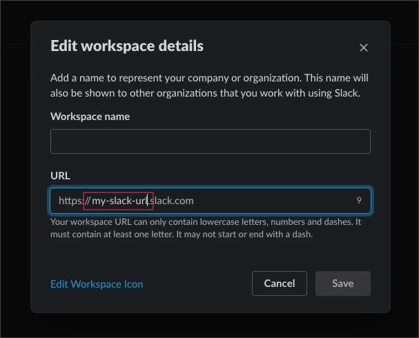

# Slack Emoji Toolkit

A small utility that allows you to manage all the custom emojis you've spent years collecting and sharing across your favourite Slack workspaces.

- [Slack Emoji Toolkit](#slack-emoji-toolkit)
    - [Why?](#why)
  - [Requirements](#requirements)
    - [Getting the Id](#getting-the-id)
    - [Getting the Cookie](#getting-the-cookie)
    - [Getting the Token](#getting-the-token)
    - [Getting the URL](#getting-the-url)
  - [Installation](#installation)
  - [Usage](#usage)
    - [Downloading Emojis](#downloading-emojis)
      - [Examples:](#examples)
      - [Additional Options](#additional-options)
    - [Uploading Emojis](#uploading-emojis)
      - [Examples](#examples-1)
      - [Additional Options](#additional-options-1)
    - [Deleting](#deleting)
      - [Examples](#examples-2)
      - [Additional Options](#additional-options-2)
  - [Building & Contributing](#building--contributing)
  - [Acknowledgements](#acknowledgements)
  - [License](#license)

### Why?

There is a non-zero number of times I've left a gig and wanted to take my emojis with me so I could share them with new coworkers. There is also a non-zero number of times I've been asked by _former_ coworkers to send them all our custom emojis for the same reason.

I am lazy and this utility makes the process incredibly simple.

## Requirements

Before you begin using `slack-emoji-toolkit`, you will need the following:

1. [jq](https://stedolan.github.io/jq/)
2. Bash version 4, or higher.
3. A target Slack workspace, or team, id.
4. Your Slack session cookie.
5. A request token so the toolkit can make API requests on your behalf.
6. The URL for the target workspace if you wish to `upload` or `delete` emojis.

The following steps will require you open your target Slack workspace in a browser. Chrom(e|ium) is assumed here.
### Getting the Id

Every team on Slack as a unique identifier. You can find it in your browser's address bar:


Between `client/` and `/CXXXXXX`.

### Getting the Cookie
In the same tab, access Chrome's "Developer Tools":
1. Select the "Network" tab.
2. In the filter field, add "emoji info". It'll narrow the request list down.
3. Select the first result; `info?fp=97`.
4. Click on the "Request Headers" section in the request details section.
5. In the `cookie` header, search for the entry named `d`. This is a big block of text, so you'll have to do some searching.


### Getting the Token
In the detail section of the same request, click on the "Payload" tab. Under the "Request Payload" section, you will see a JSON object. Within the object is a key named `token`. Save the associated value.


### Getting the URL
For destructive operations, you will need to have adequate permissions. Uploading and deleting emojis requires access to a different part of the Slack interface. For the tool to access the associated pages, it needs to know your "workspace URL". It's probably the easiest bit of information to get. Just click on your workspace name in the top left of the Slack app:



## Installation
The command is completely self-contained in a single Bash script. Drop it in your system's `$PATH` and you're good to go. In the following example, we're saving it directly to `/usr/local/bin/slack-emoji-toolkit`:

```bash
$ curl -s https://raw.githubusercontent.com/wilhelm-murdoch/slack-emoji-toolkit/main/slack-emoji-toolkit > /usr/local/bin/slack-emoji-toolkit
$ chmod a+x /usr/local/bin/slack-emoji-toolkit 
$ slack-emoji-toolkit --version
1.0.0
```

## Usage
For the following examples, assume you've added the following environmental variables with their associated values to keep things simple:
```
$ export $SLACK_WORKSPACE_ID=***
$ export $SLACK_WORKSPACE_DOMAIN=***
$ export $SLACK_WORKSPACE_COOKIE=***
$ export $SLACK_WORKSPACE_TOKEN=***
```
```
slack-emoji-toolkit - Bulk manage emojis for your Slack workspace.

Usage:
  slack-emoji-toolkit [command]
  slack-emoji-toolkit [command] --help | -h
  slack-emoji-toolkit --version | -v

Commands:
  upload     Bulk upload locally-stored emojis to the specified Slack workspace. This is a function that requires additional permissions.
  delete     Delete individual, groups, or all emojis from the specified Slack workspace. This is a function that requires additional permissions.
  download   Download all custom emoji associated with the given workspace id.
```
### Downloading Emojis
Ensure the you have values for the following flags and run the command as displayed:
1. `--workspace-id`
2. `--cookie`
3. `--token`

#### Examples:
Download all custom emojis to your present working directory:
```
$ slack-emoji-toolkit download           \
  --workspace-id="${SLACK_WORKSPACE_ID}" \
  --token="${SLACK_WORKSPACE_TOKEN}"     \
  --cookie="${SLACK_WORKSPACE_COOKIE}"

[INF] saving :stonks-1: to ./stonks-1.png... done!
[INF] saving :stonks-2: to ./stonks-2.png... done!
[INF] saving :stonks-3: to ./stonks-3.png... done!
[INF] saving :stonks-4: to ./stonks-4.png... done!
[INF] saving :stonks-5: to ./stonks-5.png... done!
[INF] all done; exiting ...
```
Perform a dry run before downloading all custom emojis to a target directory:
```
$ slack-emoji-toolkit download           \
  --workspace-id="${SLACK_WORKSPACE_ID}" \
  --token="${SLACK_WORKSPACE_TOKEN}"     \
  --cookie="${SLACK_WORKSPACE_COOKIE}"   \
  --destination=tmp/                     \
  --dry-run

[INF] saving :stonks-1: to ./tmp/stonks-1.png... skipped!
[INF] saving :stonks-2: to ./tmp/stonks-2.png... skipped!
[INF] saving :stonks-3: to ./tmp/stonks-3.png... skipped!
[INF] saving :stonks-4: to ./tmp/stonks-4.png... skipped!
[INF] saving :stonks-5: to ./tmp/stonks-5.png... skipped!
[INF] all done; exiting ...
```
#### Additional Options
```
slack-emoji-toolkit download - Download all custom emoji associated with the given workspace id.

Usage:
  slack-emoji-toolkit download [options]
  slack-emoji-toolkit download --help | -h

Options:
  --help, -h
    Show this help

  --workspace-id ID (required)
    The unique identifier for your Slack workspace.

  --token TOKEN (required)
    The unique token associated with the API requests for the target Slack workspace.

  --cookie COOKIE (required)
    The value of the "d" cookie header used to authenticate with the target Slack workspace.

  --count COUNT
    The number of results to page through at a time.
    Default: 10

  --destination DESTINATION
    The directory in which emojis will be saved.
    Default: .

  --dry-run
    Query, but make no destructive changes.

  --debug
    Use to `set -x` for Bash while also activating high verbosity for curl commands. Useful for troubleshooting requests.
```
### Uploading Emojis
Ensure the you have values for the following flags and run the command as displayed:
1. `--workspace-domain`
2. `--cookie`
3. `--token`

#### Examples
Upload all supported images located in your present working directory to the target Slack workspace:
```
$ slack-emoji-toolkit upload                     \
  --workspace-domain="${SLACK_WORKSPACE_DOMAIN}" \
  --token="${SLACK_WORKSPACE_TOKEN}"             \
  --cookie="${SLACK_WORKSPACE_COOKIE}"

Upload 5 image(s) to the target workspace my-slack-url? [y/N]: y
[INF] uploading ./stonks-1.png as :stonks-1:... done!
[INF] uploading ./stonks-2.png as :stonks-2:... done!
[INF] uploading ./stonks-3.png as :stonks-3:... done!
[INF] uploading ./stonks-4.png as :stonks-4:... done!
[INF] uploading ./stonks-5.png as :stonks-5:... done!
[INF] all done; exiting ...
```
Upload images from an alternate target source directory and add a prefix to each emoji name:
```
$ slack-emoji-toolkit upload                     \
  --workspace-domain="${SLACK_WORKSPACE_DOMAIN}" \
  --token="${SLACK_WORKSPACE_TOKEN}"             \
  --cookie="${SLACK_WORKSPACE_COOKIE}"           \
  --source="${HOME}/Pictures"                    \
  --prefix=merp-

Upload 5 image(s) to the target workspace my-slack-url? [y/N]: y
[INF] uploading ~/Pictures/stonks-1.png as :merp-stonks-1:... done!
[INF] uploading ~/Pictures/stonks-2.png as :merp-stonks-2:... done!
[INF] uploading ~/Pictures/stonks-3.png as :merp-stonks-3:... done!
[INF] uploading ~/Pictures/stonks-4.png as :merp-stonks-4:... done!
[INF] uploading ~/Pictures/stonks-5.png as :merp-stonks-5:... done!
[INF] all done; exiting ...
```
#### Additional Options
```
slack-emoji-toolkit upload - Bulk upload locally-stored emojis to the specified Slack workspace. This is a function that requires additional permissions.

Usage:
  slack-emoji-toolkit upload [options]
  slack-emoji-toolkit upload --help | -h

Options:
  --help, -h
    Show this help

  --workspace-domain DOMAIN (required)
    The unique subdomain associated with the target workspace.

  --workspace-id ID (required)
    The unique identifier for your Slack workspace.

  --token TOKEN (required)
    The unique token associated with the API requests for the target Slack workspace.

  --cookie COOKIE (required)
    The value of the "d" cookie header used to authenticate with the target Slack workspace.

  --source SOURCE
    The source directory for your emojis. Defaults to the present working directory.
    Default: .

  --prefix PREFIX
    Add a prefix to the name of all uploaded emojis.

  --suffix SUFFIX
    Add a suffix to the name of all uploaded emojis.

  --dry-run
    Query, but make no destructive changes.

  --debug
    Use to `set -x` for Bash while also activating high verbosity for curl commands. Useful for troubleshooting requests.
```
### Deleting
Ensure the you have values for the following flags and run the command as displayed:
1. `--workspace-domain`
2. `--cookie`
3. `--token`
#### Examples
Delete a single named emoji:
```
$ slack-emoji-toolkit delete                     \
  --workspace-domain="${SLACK_WORKSPACE_DOMAIN}" \
  --token="${SLACK_WORKSPACE_TOKEN}"             \
  --cookie="${SLACK_WORKSPACE_COOKIE}"           \
  --name=boop

[???] delete the emoji named :boop: from the target workspace my-slack-url? [y/N]: y
[INF] removing :boop: from workspace ... deleted!
[INF] all done; exiting ...
```
Bulk delete _all_ custom emojis and skip all confirmation steps:
```
$ slack-emoji-toolkit delete                     \
  --workspace-domain="${SLACK_WORKSPACE_DOMAIN}" \
  --token="${SLACK_WORKSPACE_TOKEN}"             \
  --cookie="${SLACK_WORKSPACE_COOKIE}"           \
  --nuke-from-orbit

[INF] fetching emojis from page 1 of 6... done!
[INF] fetching emojis from page 2 of 6... done!
[INF] fetching emojis from page 3 of 6... done!
[INF] fetching emojis from page 4 of 6... done!
[INF] fetching emojis from page 5 of 6... done!
[INF] fetching emojis from page 6 of 6... done!
[INF] finished paging through results; moving on ...
[???] start deleting 59 emoji(s) from the target workspace my-slack-url? [y/N]: y
[INF] deleting :boops: ... deleted!
[INF] deleting :merp: ... deleted!
[INF] deleting :derp: ... deleted!
[INF] deleting :booyah: ... deleted!
[INF] deleting :schmoop: ... deleted!
... more log output ...
[INF] all done; exiting ...
```
Delete emojis created by a specified set of users and matching various search terms:
```
$ slack-emoji-toolkit delete                     \
  --workspace-domain="${SLACK_WORKSPACE_DOMAIN}" \
  --token="${SLACK_WORKSPACE_TOKEN}"             \
  --cookie="${SLACK_WORKSPACE_COOKIE}"           \
  --user-id=XXXXX1                               \
  --user-id=XXXXX2                               \
  --query=stonks                                 \
  --query=boop                                   \
  --nuke-from-orbit

[INF] fetching emojis from page 1 of 1... done!
[INF] finished paging through results; moving on ...
[???] start deleting 6 emoji(s) from the target workspace my-slack-url? [y/N]: y
[INF] deleting :boops: ... deleted!
[INF] deleting :boop: ... deleted!
[INF] deleting :stonks-1: ... deleted!
[INF] deleting :stonks-2: ... deleted!
[INF] deleting :stonks-3: ... deleted!
... more log output ...
[INF] all done; exiting ...
```
#### Additional Options
```
slack-emoji-toolkit delete - Delete individual, groups, or all emojis from the specified Slack workspace. This is a function that requires additional permissions.

Usage:
  slack-emoji-toolkit delete [options]
  slack-emoji-toolkit delete --help | -h

Options:
  --help, -h
    Show this help

  --workspace-domain DOMAIN (required)
    The unique subdomain associated with the target workspace.

  --token TOKEN (required)
    The unique token associated with the API requests for the target Slack workspace.

  --cookie COOKIE (required)
    The value of the "d" cookie header used to authenticate with the target Slack workspace.

  --query QUERIES (repeatable)
    Filter emojis that match the specified term. Cannot be used with --name.

  --user-id USERS (repeatable)
    Filter emojis submitted by a specific user, or users. Cannot be used with --name.

  --name NAME
    Delete the emoji with the specified name. Cannot be used with --filter.

  --count COUNT
    The number of results to page through at a time.
    Default: 10

  --nuke-from-orbit
    Skip individual confirmation of delete operations. This is a highly destructive action. Be sure to download your emoji first!

  --dry-run
    Query, but make no destructive changes.

  --debug
    Use to `set -x` for Bash while also activating high verbosity for curl commands. Useful for troubleshooting requests.
```
## Building & Contributing

This tool is written in Bash, but built with [Bashly](https://bashly.dannyb.co/). Perform the following steps to begin developing locally:

1. Install Bashly locally with `gem install bashly`.
2. Clone this repository with `git@github.com:wilhelm-murdoch/slack-emoji-toolkit.git`.
3. Modify the tool's command configuration in `src/bashly.yml`.
4. Run `bashly g` from the root of this project to stub out any new commands or update any help documentation.
5. Start coding your new command from the stubbed Bash script in `src/*_command.sh`.
6. Run `bashly g` every time you wish to test your progress as Bashly consolidates all changes to the `slack-emoji-toolkit` script located at the root of this project.

Contributions are always welcome. Just create a PR and remember to be nice.
## Acknowledgements

This stupid little tool couldn't be possible without the following projects:

 - [jq](https://stedolan.github.io/jq/)
 - [Bashly](https://bashly.dannyb.co/)
 - [readme.so](https://readme.so/)

## License

[Unlicense](https://choosealicense.com/licenses/unlicense/)

  